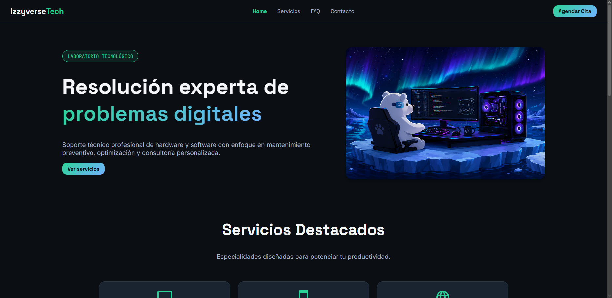
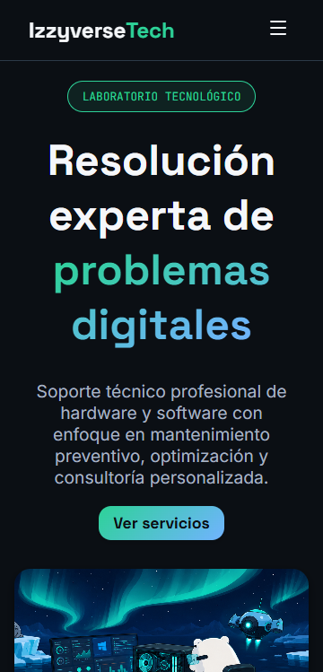

# Izzyverse Tech Portfolio

[](https://izzyverse-tech.vercel.app)

Portfolio profesional y moderno para una marca de soporte técnico, mantenimiento y consultoría tecnológica. La web está diseñada para presentar servicios, destacar soluciones técnicas y facilitar la captura de leads a través de páginas de navegación clara y visualmente pulcra.

## ✨ Descripción del proyecto

Izzyverse Tech Portfolio es un sitio web desarrollado con React + TypeScript y Vite, pensado para comunicar una identidad tecnológica sólida y accesible. Su objetivo es presentar los servicios de soporte técnico, optimización de equipos, redes y asistencia personalizada, mientras ofrece una experiencia fluida tanto en escritorio como en dispositivos móviles.

El proyecto incluye rutas para:

- Inicio
- Servicios
- Preguntas frecuentes
- Contacto

## 🧰 Stack tecnológico

Este proyecto utiliza un stack moderno y eficiente basado en:

- TypeScript
- React
- Vite
- Sass
- React Router DOM
- React Router Hash Link
- ESLint
- pnpm

## 📁 Estructura general

```text
src/
├── App.tsx
├── main.tsx
├── components/
├── constants/
├── data/
├── hooks/
├── pages/
├── routes/
├── styles/
└── types/
```

## 🚀 Requisitos previos

Asegúrate de tener instalado:

- Node.js 18 o superior
- pnpm

## 🛠️ Instalación

1. Clona el repositorio:

```bash
git clone https://github.com/CodeInTheIzzyverse/IzzyverseTech
cd Portfolio
```

2. Instala las dependencias:

```bash
pnpm install
```

## ▶️ Ejecutar en desarrollo

Inicia la aplicación con:

```bash
pnpm dev
```

Por defecto, Vite suele dejar la app disponible en:

```text
http://localhost:5173
```

## 📦 Build de producción

Para compilar la aplicación lista para despliegue:

```bash
pnpm build
```

## 👀 Vista previa local

Puedes previsualizar la build generada con:

```bash
pnpm preview
```

## 🧪 Linting

Para revisar la calidad del código con ESLint:

```bash
pnpm lint
```

## 🌐 Despliegue

El proyecto está preparado para desplegarse en Vercel o cualquier plataforma compatible con Vite.

> Reemplaza el badge de Vercel con la URL real del despliegue cuando la tengas disponible.

## 📸 Capturas de pantalla

### Desktop



### Mobile



## 🧱 Arquitectura y patrones

El proyecto sigue una arquitectura frontend modular y orientada a componentes, con una separación clara de responsabilidades por carpetas: páginas en src/pages, componentes reutilizables en src/components, datos y constantes en src/data y src/constants, lógica reutilizable en src/hooks, y rutas centralizadas en src/routes.

Algunos patrones concretos en el código:

- Routing basado en layout y rutas anidadas con React Router DOM.
- Hook personalizado useSEO para encapsular la lógica de SEO y reutilizarla entre páginas.
- Uso de Suspense para la carga de vistas.

## 📌 Características principales

- Diseño responsivo para desktop y mobile.
- Navegación rápida entre secciones y páginas.
- Componentes reutilizables y organización clara por carpetas.
- Estilos modularizados con Sass.
- Experiencia moderna y enfocada en servicios tecnológicos.

## 🤝 Contribución

Si deseas colaborar en el proyecto:

1. Haz fork del repositorio.
2. Crea una rama con tu mejora.
3. Envía un pull request con una descripción clara del cambio.
